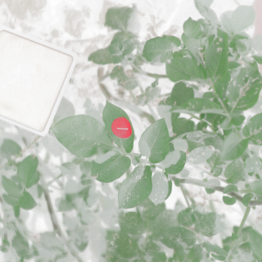
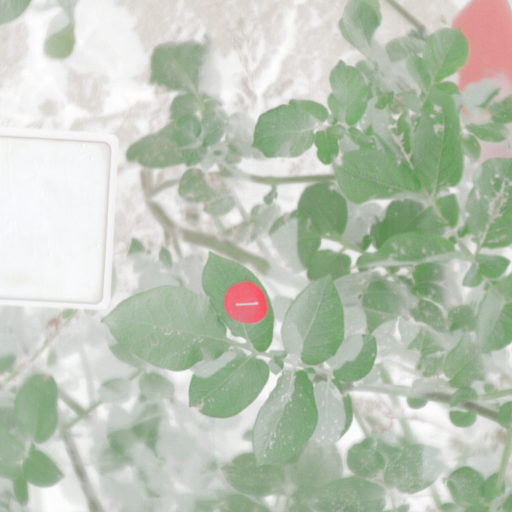

## Generate HSI of potato canopy reconstruction using RGB/IR images
### Project Overview

In this project, we used **RGB** and **near-infrared (IR)** images to generate hyperspectral images of potato canopies.

- **Data source:** Hyperspectral cubes captured with a **Specim IQ** camera.  
  *Both the RGB and IR images were extracted from the corresponding spectral bands of these cubes.*

- **Pre-processing:**  
  1. **RGB synthesis** from selected bands.  
  2. **γ-correction** applied to the synthesized RGB to emulate a commercial color camera’s visual effect.  
  3. **Stacking:** The corrected RGB channels were concatenated with the IR channel to form a **4-channel** image.  
  4. **Storage:** Each 4-channel sample was saved as a **`.png`** file for efficient training.

- **Code:** All data-processing scripts are provided in this repository.

  The RGB/IR composite image is as follows：
  <!-- RGB/IR 4-channel -->
  <p align="center">
    
    
    
  </p>

The reconstructed results and the original HSI are detailed in the folder 

## Model

We adopted **MST++**—an efficient multi-stage spectral-wise transformer—for spectral reconstruction.

> **Citation**
>
> ```bibtex
> @inproceedings{mst_pp,
>   title     = {MST++: Multi-stage Spectral-wise Transformer for Efficient Spectral Reconstruction},
>   author    = {Yuanhao Cai and Jing Lin and Zudi Lin and Haoqian Wang and Yulun Zhang and Hanspeter Pfister and Radu Timofte and Luc Van Gool},
>   booktitle = {CVPRW},
>   year      = {2022}
> }
> ```

For implementation details, see the original code base here: [MST++ GitHub](https://github.com/caiyuanhao1998/MST-plus-plus).

**It is worth noting that due to the limited training scenarios, this is a hyperspectral reconstruction solution specifically for crop canopies, not a general reconstruction solution.**
